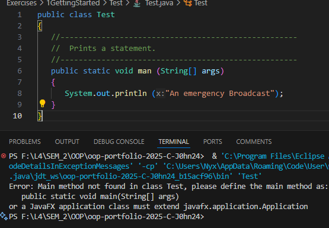

# 1 Getting Started

**to be committed by 10th February**

1 Hello World        ${\color{blue}-- completed}$\
2 Test               ${\color{blue}-- completed}$\
3 Personal Details   ${\color{blue}-- completed}$\
4 Diamonds           ${\color{blue}-- completed}$\
5 Questions          ${\color{blue}-- completed}$\

Please replace ${\color{green}-- todo}$ with ${\color{blue}-- completed}$ once done.

---

For each question in the exercise, please either display the output generated by running the program, or the answer if the task is a question.

## The screenshots contain both the code and output... You can also find the code inside folders with corresponding names.. 

1 - HelloWorld.java
    Output:
        
---

2 - Test.java
    Base Code:
        
    a. Change Test to test.\
        
            Output:"The public type test must be defined in its own file"
            Reason: Cannot overwrite bcs classes are derived from file names. 
    b. Change Emergency to emergency.\
        
            Output: "An emergency Broadcast"
            Reason: String in println function is not case sensitive.  
    c. Remove the first quotation mark in the string.\
        
            Output: "Lots of error"
            Reason: Println is having a stroke without "quotation marks", it works as an indicator i think..
    d. Change main to man.\
        
            Output: Method error
            Reason: Testosterone Overload..
    e. Change println to bogus.\
        
            Output:"The method bogus(String) is undefined for the type PrintStream"
            Reason: java doesn't know what bogus means and neither do I..
    f. Remove the semicolon at the end of the println statement.\
            
            Output:"String literal is not properly closed by a double-quote"
            Reason:Double quotation required, it works as begin and end indicator... 
---

3 - PersonalDetails.java
    Output:
        
---

4 - Diamond
    Run the "ShinyDiamond.java" present inside "Diamond" folder.
---

5 - QnA
    a. What is the latest version of the Java SDK that is available?\
        <>  PS F:\L4\SEM_2\OOP\oop-portfolio-2025-C-J0hn24> java -version
        <>  openjdk version "21.0.6" 2025-01-21 LTS
    b. What is the difference between Java SE and Java ME?\
        <>  Java SE (Standard Edition) is for Desktop and servers includes standard library.
        <>  Java ME (Micro Edition) is for Small Formfactors like phone and embeded devices..
    c. Which operating system is Java available for?\
        <>  Java is availavle on all systems bcs of the "WORA" feature
        <>  WORA = Write Once Run Anywhere
    d. What is the most popular IDE available for Java apart from Eclipse?\
        <> IntelliJ IDEA
        <> I use Visual Studio Code
    e. What is the main() function for in a Java program?
        <> Entry Point similar to "int main(){}" in C++
---

