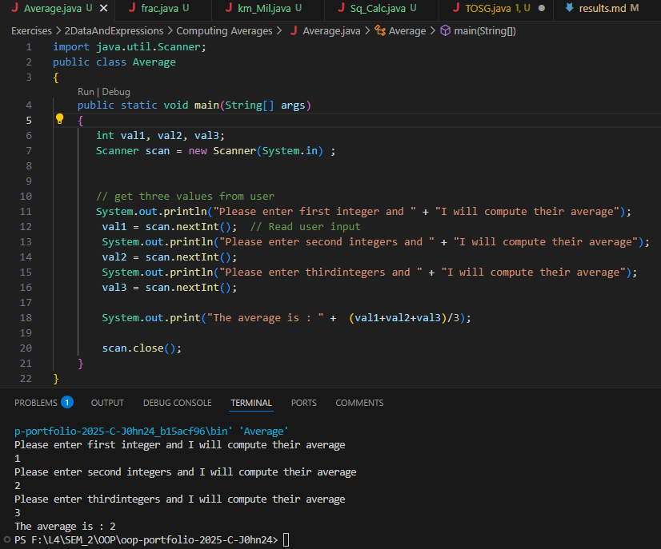

# 2 Data And Expressions

**to be committed by 17th February**

1 Table of Student Grades           ${\color{blue}-- completed}$\
2 Computing Averages                ${\color{blue}-- completed}$\
3 Miles to Kilometers               ${\color{blue}-- completed}$\
4 Square Calculations               ${\color{blue}-- completed}$\
5 Fraction                          ${\color{blue}-- completed}$

Please replace ${\color{green}-- todo}$ with ${\color{blue}-- completed}$ once done.

---

For each question in the exercise, please either display the output generated by running the program, or the answer if the task is a question.

## The screenshots contain both the code and output... You can also find the code inside folders with corresponding names.. 

1 - Table of Student Grades
    Output:
        
---

2 - Average.java
    Output:
        
---

3 - Miles_Kilometers.java
    Output:
        
---

4 - Square_Calculations.java
    Output:
    
---

5 - Fraction.java
    Output:
    
---

