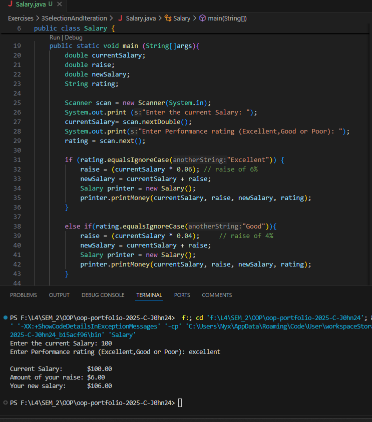
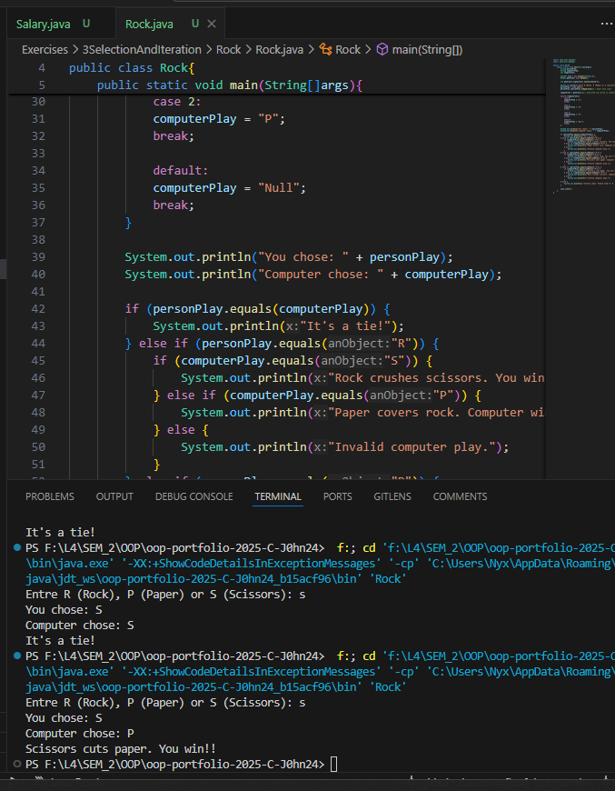
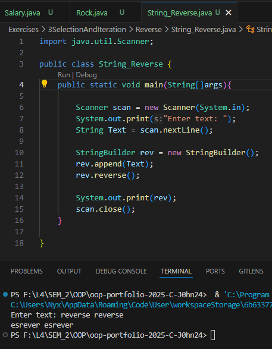
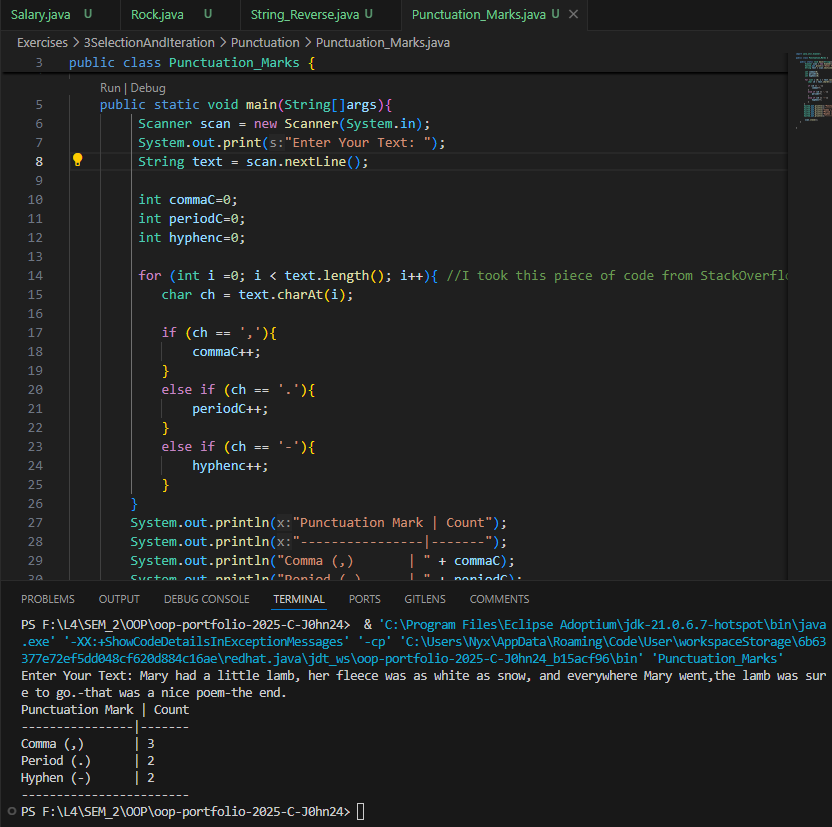

# 3 Data And Expressions

**to be committed by 24th February**

1 Computing A Pay Increase                  ${\color{blue}-- completed}$\
2 Rock, Paper, Scissors                     ${\color{blue}-- completed}$\
3 String Reverser                           ${\color{blue}-- completed}$\
4 Punctuation Marks                         ${\color{blue}-- completed}$

Please replace ${\color{green}-- todo}$ with ${\color{blue}-- completed}$ once done.

---

For each question in the exercise, please either display the output generated by running the program, or the answer if the task is a question.

## The screenshots contain both the code and output... You can also find the code inside folders with corresponding names.. 

1 - Salary > Salary.java
                Output:
                    
---

2 - Rock > Rock.java
            Output:
                
---

3 - Reverse > String_Reverse.java
                Output:
                    
---

4 - Punctuation > Punctuation_Marks.java
                    Output:
                        
---

