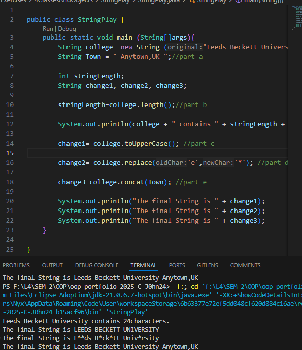
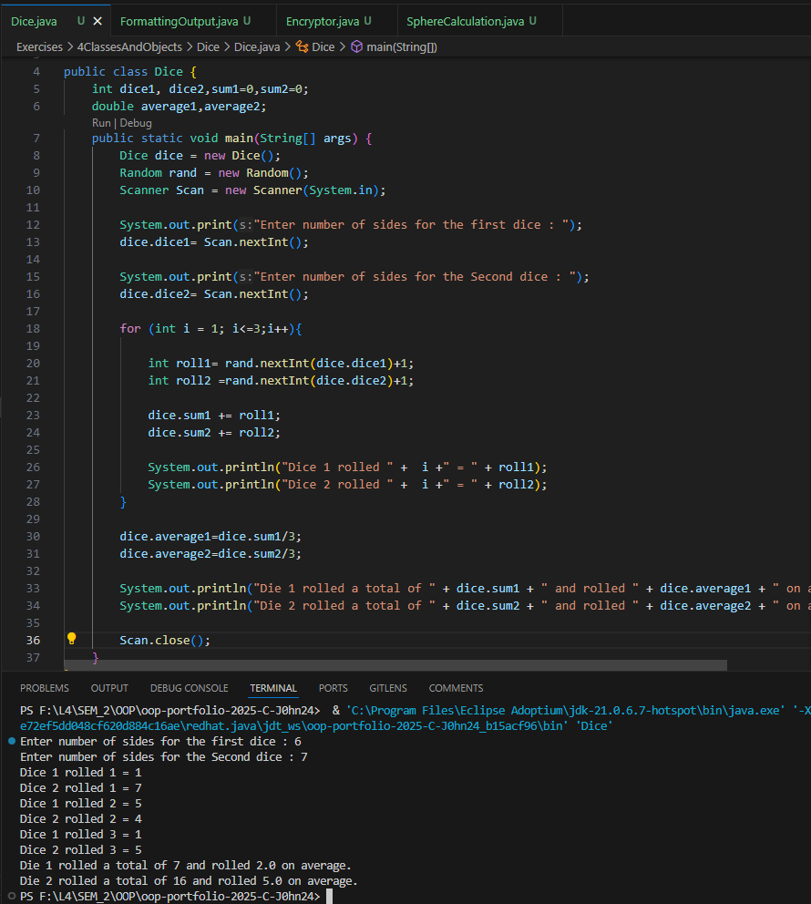
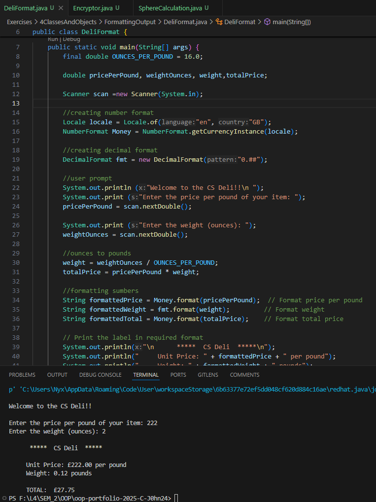
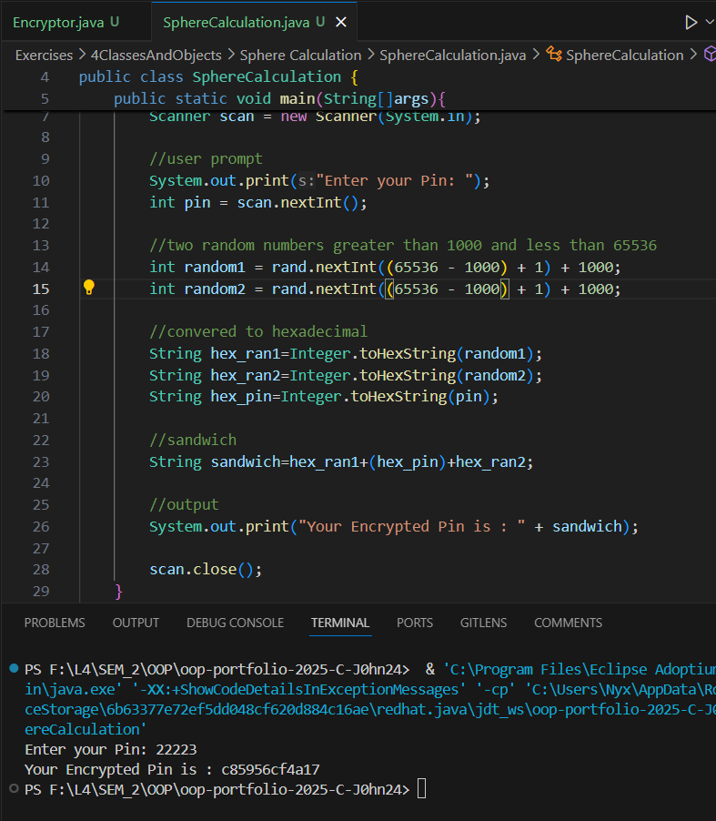
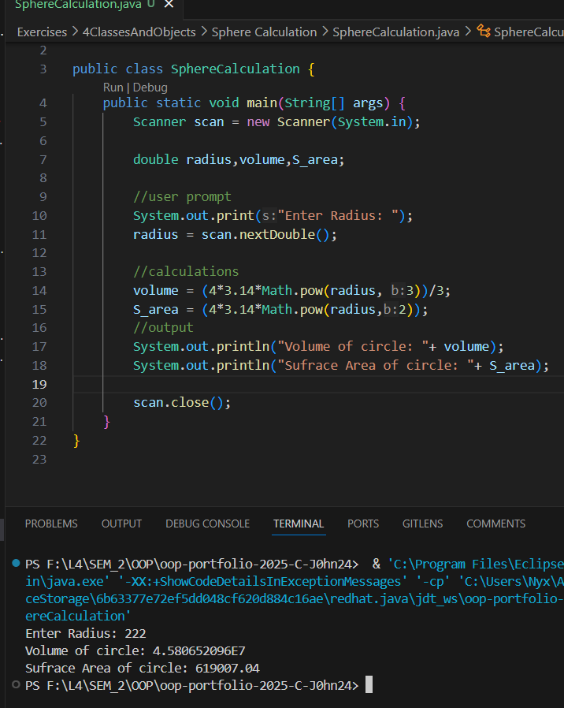

# 3 Classes And Objects

**to be committed by 3rd March**

1 Using String Objects      ${\color{blue}-- completed}$\
2 Dice                      ${\color{blue}-- completed}$\
3 Formatting Output         ${\color{blue}-- completed}$\
4 Pin Encryption            ${\color{blue}-- completed}$\
5 Sphere Calculations       ${\color{blue}-- completed}$

Please replace ${\color{green}-- todo}$ with ${\color{blue}-- completed}$ once done.

---

For each question in the exercise, please either display the output generated by running the program, or the answer if the task is a question.

## The screenshots contain both the code and output... You can also find the code inside folders with corresponding names.. 

1 -StringPlay > StringPlay.java
                    Output:
                        
---

2 -Dice > Dice.java
            Output:
                
---

3 - Formatting > DeliFormat.java
                    Output:
                        
---

4 - Pin Encryption > Encryptor.java
                        Output:
                        
---

5 - Sphere Calculation > Sphere.java
                            Output:
                                
---

