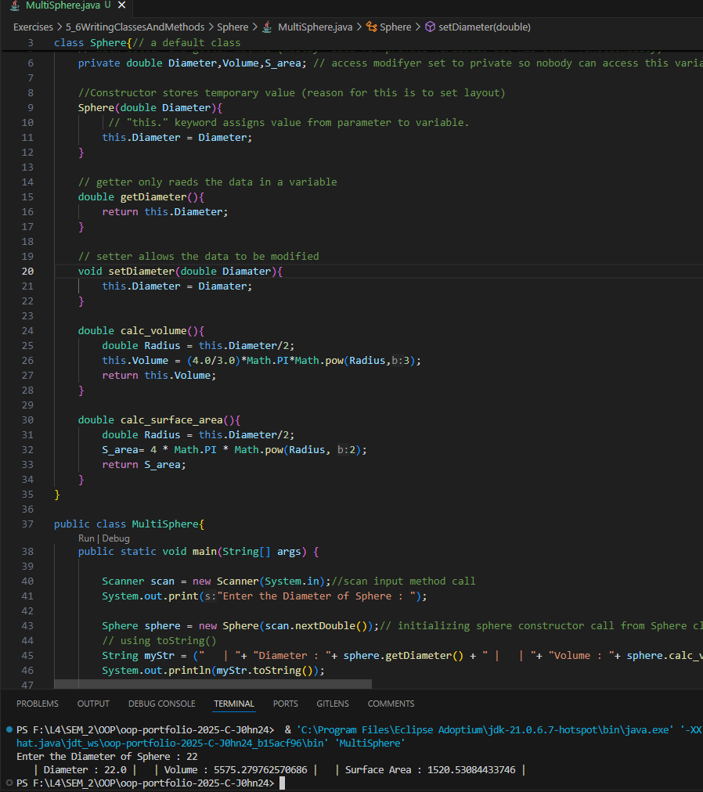
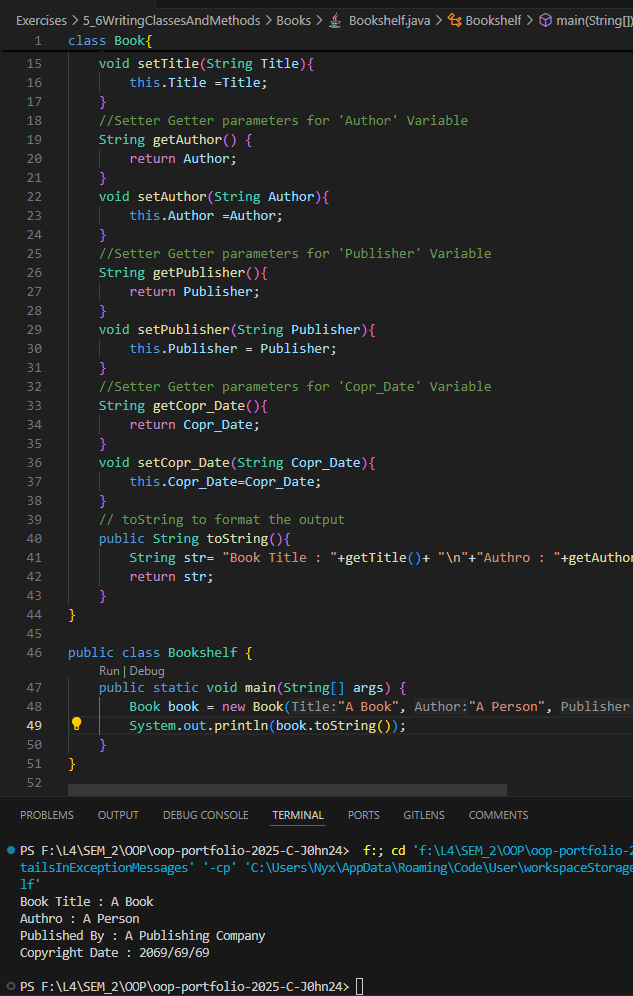
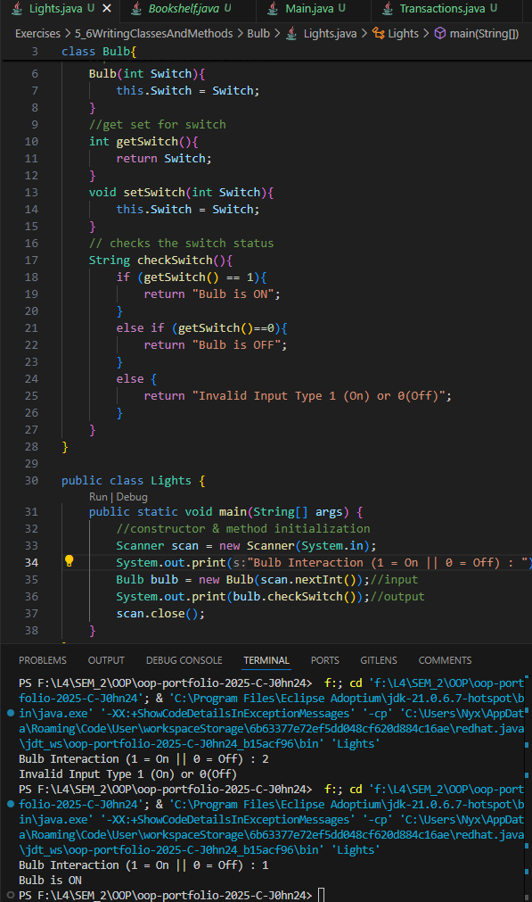
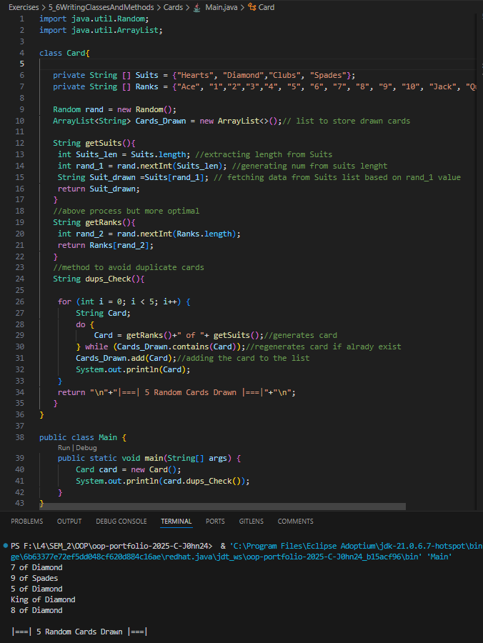

# 5&6 Writing Classes And Methods (two week's worth)

**to be committed by 17th March (extra week given and more work)**

1 Sphere                ${\color{blue}-- completed}$\
2 Books                 ${\color{blue}-- completed}$\
3 Bulb                  ${\color{blue}-- completed}$\
4 Account               ${\color{green}-- todo}$\
5 Cards                 ${\color{blue}-- completed}$

Please replace ${\color{green}-- todo}$ with ${\color{blue}-- completed}$ once done.

---

For each question in the exercise, please either display the output generated by running the program, or the answer if the task is a question.

## The screenshots contain both the code and output... You can also find the code inside folders with corresponding names.. 

1 -Sphere > MultiSphere.java
                Output: 
---

2 -Books > Bookshelf.java
                Output: 
---

3 - Bulb > Lights.java
                Output: 
---

4 - Account > Transaction.java(unit examples not provided)
                Output: 
---

5 - Cards > Main.java
                Output: 
---
