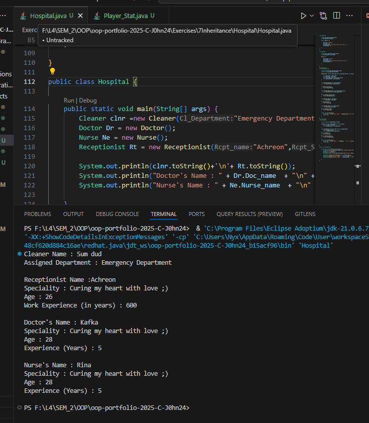
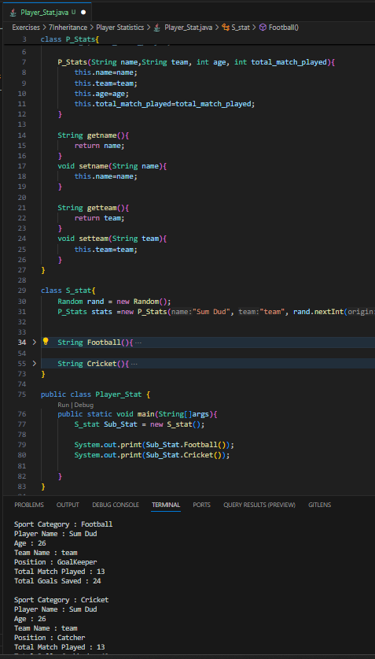

# 7 Inheritance

**to be committed by 24th March**

1 Hospital                          ${\color{blue}-- completed}$\
2 Player Statistics                 ${\color{blue}-- completed}$

Please replace ${\color{green}-- todo}$ with ${\color{blue}-- completed}$ once done.

---

For each question in the exercise, please either display the output generated by running the program, or the answer if the task is a question.

## The screenshots contain both the code and output... You can also find the code inside folders with corresponding names.. 

1 - Hospital > Hospital.java
                Output:
---

2 - Player Statistic > Player_Stat.java
                        Output:
---

