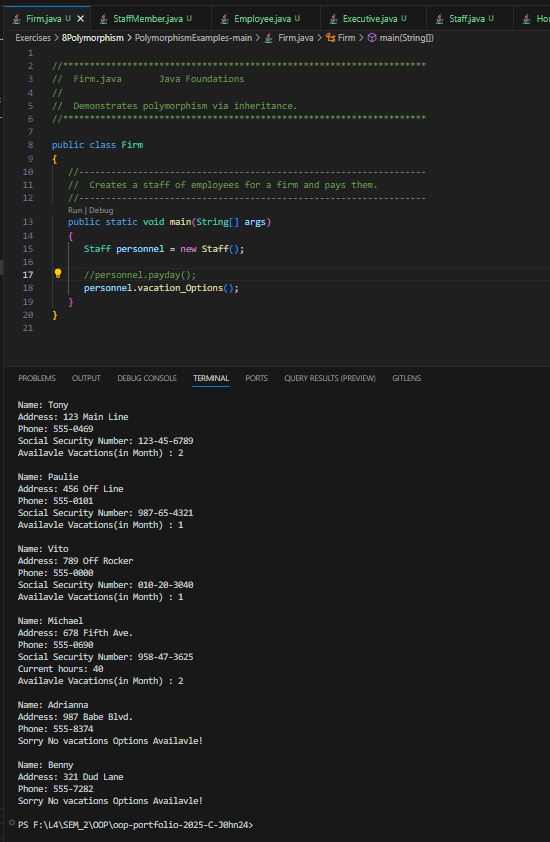
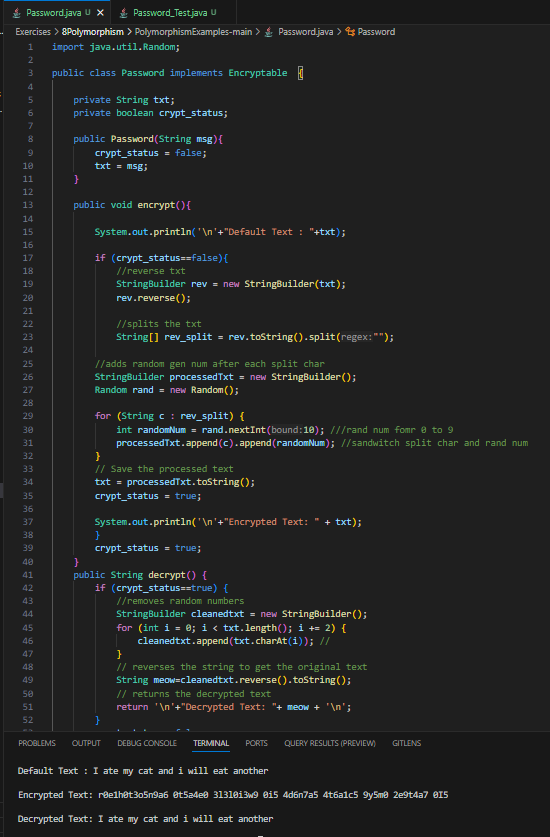

# 8 Polymorphism

**to be committed by 31st March**

1 Firm Vacation                 ${\color{blue}-- completed}$\
2 Firm Vacation                 ${\color{blue}-- completed}$

Please replace ${\color{green}-- todo}$ with ${\color{blue}-- completed}$ once done.

---

For each question in the exercise, please either display the output generated by running the program, or the answer if the task is a question.

## The screenshots contain both the code and output... You can also find the code inside folders with corresponding names.. 

1 - PolymorphismExamples-main > Firm.java
                        Output:
---

2 - PolymorphismExamples-main > Password.java
                        Output:
---
