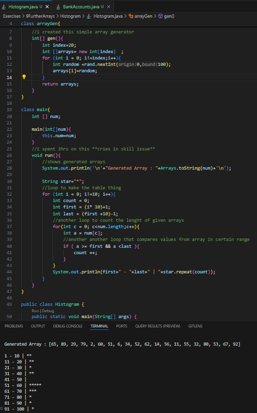
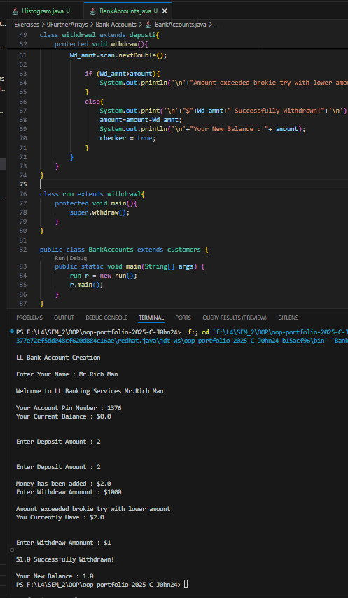
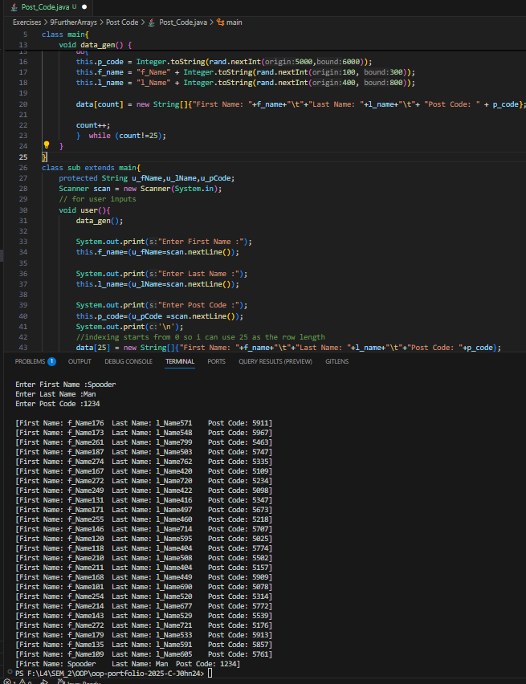
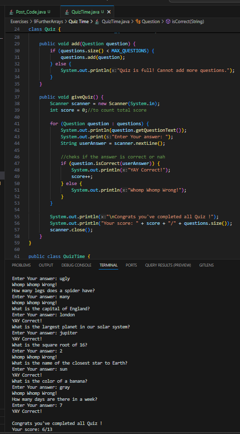

# 9 Further Arrays

**to be committed by 7th April`**

1 Histogram                 ${\color{blue}-- completed}$\
2 LL Bank Accounts          ${\color{blue}-- completed}$\
3 Post Codes                ${\color{blue}-- completed}$\
4 Quiz Time                 ${\color{blue}-- completed}$

Please replace ${\color{green}-- todo}$ with ${\color{blue}-- completed}$ once done.

---

For each question in the exercise, please either display the output generated by running the program, or the answer if the task is a question.

## The screenshots contain both the code and output... You can also find the code inside folders with corresponding names.. 

1 -Histogram > Histogram.java
                        Output:
---

2 -Bank Account > BankAccounts.java
                        Output: 
---

3 -Post Code > Post_Code.java
                        Output: 
---

4 -Quiz Time > QuizTime.java
                        Output:

---

